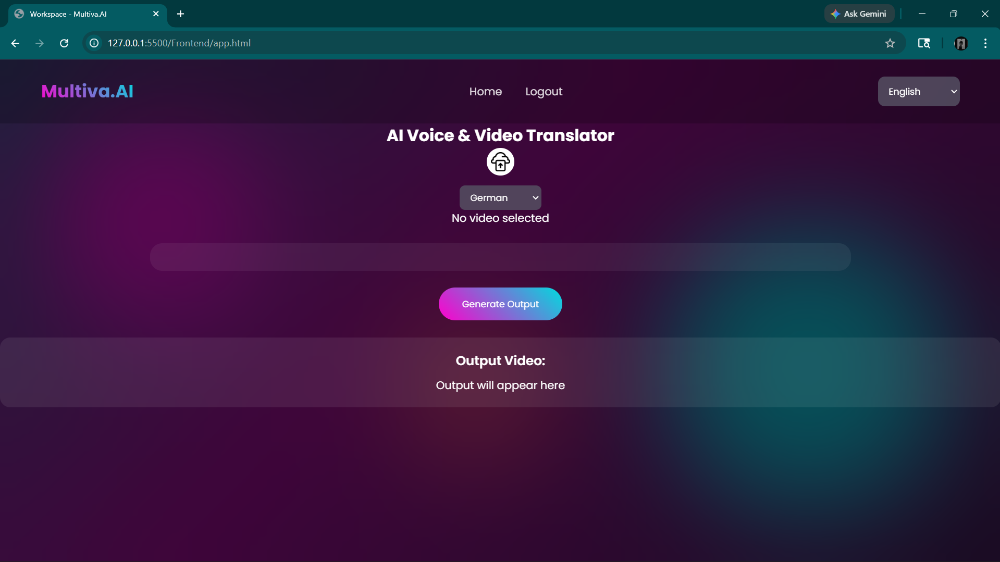
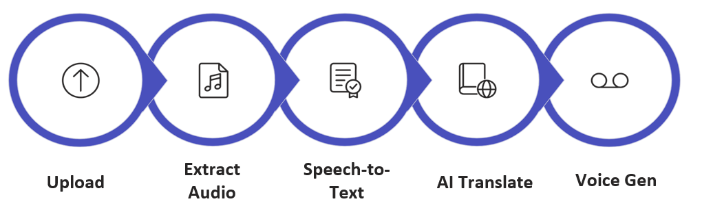
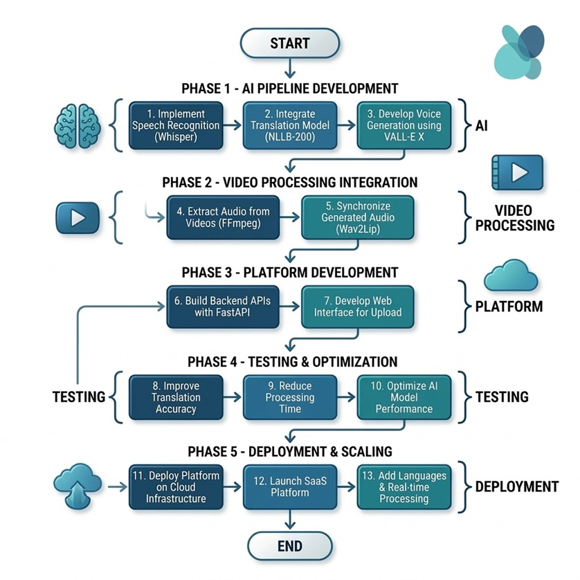

# Multiva AI — Multilingual Auto Dubbing Platform

Multiva AI is an end-to-end system that enables automatic translation and dubbing of videos into multiple languages while preserving the original speaker’s voice characteristics and ensuring lip synchronization.

This repository contains a working MVP that demonstrates the complete pipeline from video upload to dubbed video output.


## Demo

Demo Video Link:  
https://drive.google.com/file/d/1Wh4LZdLM5Xg03KIK2_BARlfF21dlo0c-/view?usp=sharing


## User Interface

The following screenshot shows the working frontend interface where users can upload videos, select a target language, and generate dubbed output.




## Problem Statement

Content today is largely restricted by language barriers. Existing dubbing solutions are either manual, expensive, or fail to preserve the original speaker’s identity and synchronization.

Multiva AI addresses this by providing an automated pipeline that performs speech recognition, translation, voice cloning, and lip synchronization in a single system.


## Solution Overview

The platform processes an input video and produces a dubbed version in a target language through a modular AI pipeline:

1. Extract audio from video  
2. Convert speech to text  
3. Translate text to target language  
4. Generate cloned speech in target language  
5. Synchronize generated audio with video  
6. Deliver final dubbed output  


## Workflow

The following diagram represents the core processing pipeline of the system.




## Implementation Overview

The following diagram illustrates the development and implementation phases including AI pipeline, video processing, platform integration, and deployment.




## System Architecture

```

User (Frontend Interface)
↓
Video Upload (Frontend)
↓
Backend API (app.py)
↓
Video Processing Module (video_processing.py)
↓
Speech-to-Text (speech_to_text.py - Whisper)
↓
Translation (translation.py - NLLB)
↓
Text-to-Speech (tts_module.py - XTTS)
↓
Lip Sync (lip_sync_generate.py - Wav2Lip)
↓
Final Video Generation
↓
Frontend Playback / Output Display

```


## Tech Stack

### Frontend
- HTML, CSS, JavaScript

### Backend
- Python (Modular AI pipeline)

### AI Models
- Whisper (Speech-to-Text)
- Facebook NLLB (Translation)
- Coqui XTTS / YourTTS (Voice Cloning)
- Wav2Lip (Lip Synchronization)


## Project Structure

```

wtc-round-2-group-1-alchemists/
│
├── assets/
│   ├── implementation.png
│   ├── ui.png
│   └── workflow.png
│
├── Backend_pipeline/
│   ├── **init**.py
│   ├── app.py
│   ├── Demo.py
│   ├── speech_to_text.py
│   ├── translation.py
│   ├── tts_module.py
│   ├── video_processing.py
│   ├── lip_sync_generate.py
│   ├── lip_sync_loader.py
│   ├── lip_sync_test.py
│   ├── test_tts.py
│   └── xtts_test.py
│
├── Frontend/
│   ├── app.html
│   ├── index.html
│   ├── Login.html
│   ├── lang.json
│   ├── script.js
│   └── style.css
│
├── requirements.txt
├── requirements-base.txt
├── runtime.txt
├── wav2lip_loader
└── README.md


````


## Setup Instructions

### 1. Clone Repository

```bash
git clone https://github.com/WTC-Group-1/wtc-round-2-group-1-alchemists.git
cd wtc-round-2-group-1-alchemists
````


### 2. Install Dependencies

```bash
pip install -r requirements.txt
```


## Running the Project

### Backend

```bash
python Backend_pipeline/app.py
```


### Frontend

Open in browser:

```
http://127.0.0.1:5500/Frontend/app.html
```


## MVP Features

* Video upload interface
* Speech-to-text conversion
* Multilingual translation
* Voice cloning
* Lip synchronization
* End-to-end video dubbing pipeline


## Scalability Approach

* Modular pipeline allows independent scaling of components
* AI models can be deployed on GPU-based infrastructure
* Each module can be converted into microservices
* Suitable for cloud and distributed deployment


## Reliability Considerations

* Decoupled modules reduce system failure impact
* Intermediate outputs can be cached
* Retry mechanisms can be implemented per stage
* Structured pipeline ensures consistent execution


## Team Contributions

* Mudit Agrawal — AI pipeline development, model integration, backend processing
* Aditya Sahani — Database management and documentation
* Nikhil Raghav — Frontend development and multilingual integration


Team Multiva — System design and overall implementation


## Contact

* Mudit Agrawal — [muditagrawal03@gmail.com](mailto:muditagrawal03@gmail.com)
* Aditya Sahani — [adityasahani151104@gmail.com](mailto:adityasahani151104@gmail.com)
* Nikhil Raghav — [nikhilraghav7830@gmail.com](mailto:nikhilraghav7830@gmail.com)

## Evaluation Readiness

This repository includes:

* A functional MVP demonstrating core features
* Clear workflow and implementation diagrams
* Defined system architecture
* Scalable and modular design
* Version-controlled contributions


## License

MIT License


## Support and Contributions

If you find this project useful, please consider starring the repository.

We welcome contributions, feedback, and collaboration opportunities. Feel free to connect with the team.

Thank You

